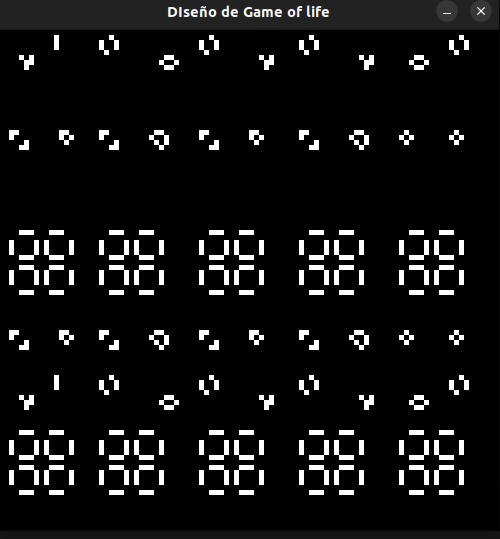

# Conway's Game of Life 🧬

Este es un proyecto en Rust usando la librería [Raylib](https://www.raylib.com/) para simular el famoso autómata celular **Game of Life** de John Conway.  
Cada celda evoluciona según reglas simples, pero da lugar a patrones complejos, incluyendo osciladores, naves espaciales y estructuras estables.

---

## 🎮 ¿Qué hace este programa?

- Renderiza en tiempo real una grilla 100x100 de celdas.
- Muestra patrones como:
  - Glider
  - Blinker
  - Toad
  - Beacon
  - Pulsar
  - LWSS (Lightweight spaceship)
  - Boat
  - Tub
  - Loaf
- Aplica las reglas clásicas de Conway para hacer que estos patrones evolucionen.

---

## 🖼️ Vista previa (GIF)

¡Así se ve el juego corriendo!



---

## ⚙️ Cómo correr el proyecto

Asegúrate de tener Rust instalado. Luego ejecutá:

```bash
cargo run
```

Si tu archivo está en `src/bin/`, podés correr:

```bash
cargo run --bin main
```

---

## 📚 Reglas del Juego de la Vida

Para cada celda:

1. 🔴 Si está viva:
   - Muere si tiene menos de 2 vecinos vivos (soledad).
   - Muere si tiene más de 3 vecinos vivos (sobrepoblación).
   - Sobrevive si tiene 2 o 3 vecinos vivos.
2. 🟢 Si está muerta:
   - Nace si tiene exactamente 3 vecinos vivos (reproducción).

---

## 👨‍💻 Hecho con ❤️ en Rust

Este proyecto fue desarrollado como parte de un laboratorio para practicar renderizado en tiempo real, programación con Raylib y simulación basada en reglas.

---
